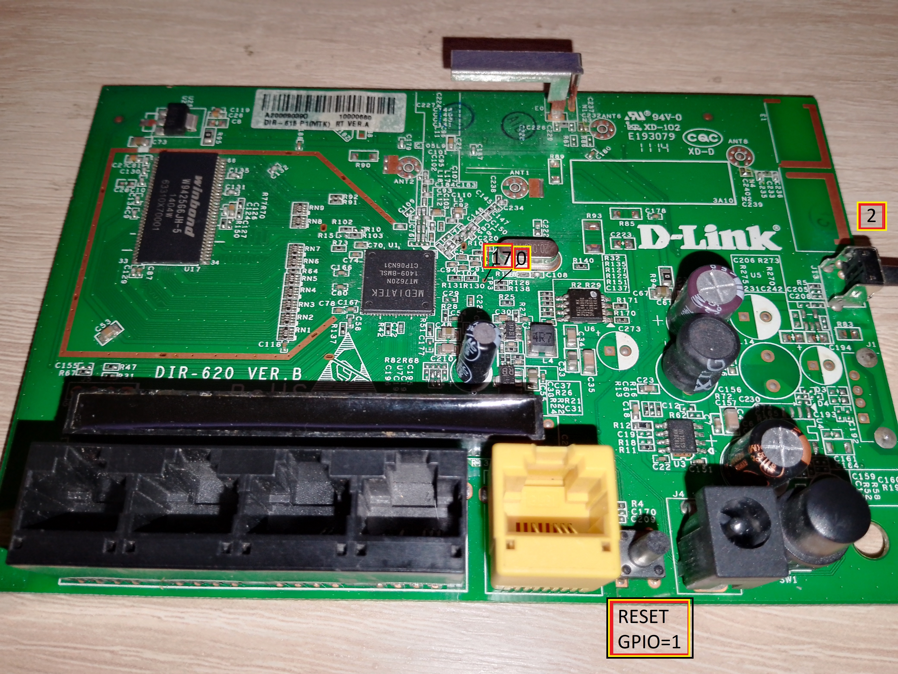
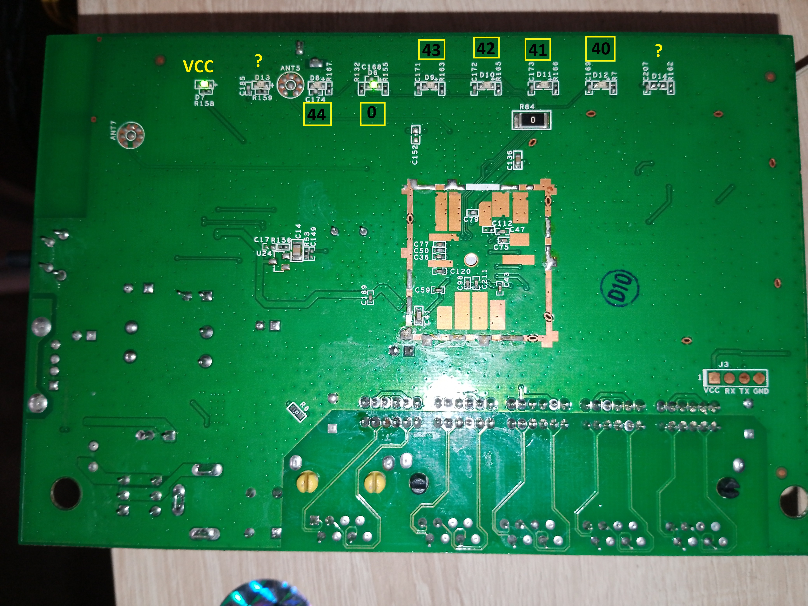
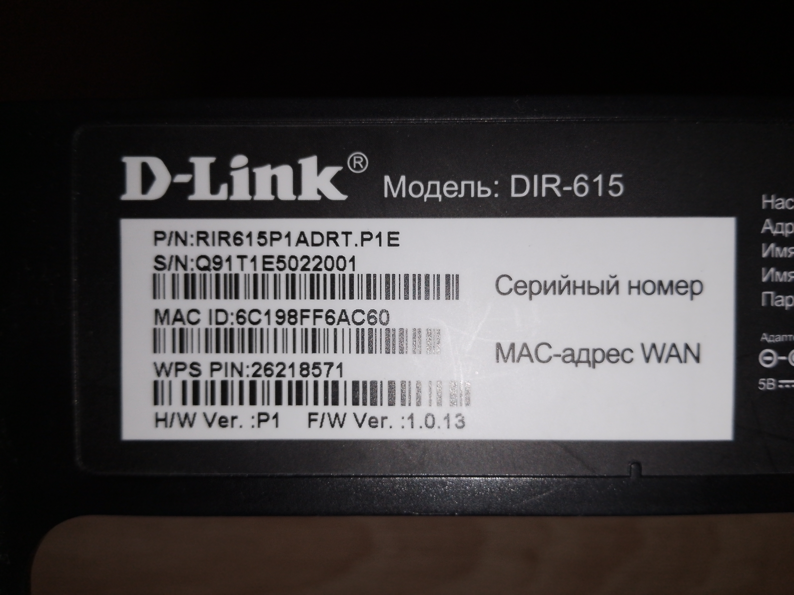

# Openwrt 19.07.10 D-Link Dir-615 v.P1




# Прошивка по TFTP uboot 1.1.3
Подключаемся через UART (скорость:57200)

Подключаемся через Ethernet

ПК IP 192.168.0.2

Положить в папку сервера TFTP файл openwrt-ramips-mt7620-dlink_dir-615-p1-squashfs-sysupgrade.bin и переименовать по короче (dir.bin например)

Запускаем на ПК TFTP сервер 192.168.0.2 

Включаем роутер ждем сообщения:
```
1: Load system code to SDRAM via TFTP.
2: Load system code then write to Flash via TFTP.
3: Boot system code via Flash (default).
4: Entr boot command line interface.
7: Load Boot Loader code then write to Flash via Serial.
9: Load Boot Loader code then write to Flash via TFTP.
```
Жмем 2
```
ou choosed 2
... 0
raspi_read: from:40028 len:6
2: System Load Linux Kernel then write to Flash via TFTP.
Warning!! Erase Linux in Flash then burn new one. Are you sure?(Y/N)
```
Жмем Y
```
Please Input new ones /or Ctrl-C to discard
.Input device IP (192.168.0.1) ==:192.168.0.1
```
Жмем Enter
```
.Input server IP (192.168.0.2) ==:192.168.0.2
```
Жмем Enter
```
.Input Linux Kernel filename () ==:
```
Пишем имя файла прошивки, который мы положили в папку TFTP (например dir.bin)

Ждем окончания прошивки.

Default IP 192.168.1.1

Больше информации [FAQ: по прошивке](https://habr.com/ru/articles/192414/).

# Установка Build system на Ubuntu
### Установите
```
sudo apt update
sudo apt install binutils bzip2 diff find flex gawk gcc-6+ getopt grep install libc-dev libz-dev
make4.1+ perl python3.7+ rsync subversion unzip which
```
### Получение файлов
Скачайте этот репозиторий распакуйте zip, перейдите в папку openwrt-19.07.10
```
cd openwrt-19.07.10
```
Либо git-clone
```
git clone https://github.com/hazy1710/DIR-615-P1.git
cd DIR-615-P1/openwrt-19.07.10
```
### Обновите feeds
```
./scripts/feeds update -a
./scripts/feeds install -a
 ```
### Настройте образ прошивки
```
make menuconfig
```
### Создайте образ прошивки
```
make -j$(nproc) defconfig download clean world
```
Прошивка будет лежать в openwrt-19.07.10/bin/targets/ramips/mt7620/

Больше информации на [openwrt.org](https://openwrt.org/)

# Совместимость
Все что вы делаете, вы делаете на свой страх и риск.

Данная прошивка проверена на устройстве отображенного на фото.

Судя по фото из интернета [DIR-620](https://openwrt.org/toh/d-link/dir-620) F1 имеет схожую компановку (только USB распаян и RAM 64Mb).

На DIR-620 F1 должно работать, но пока не кем не проверено.
